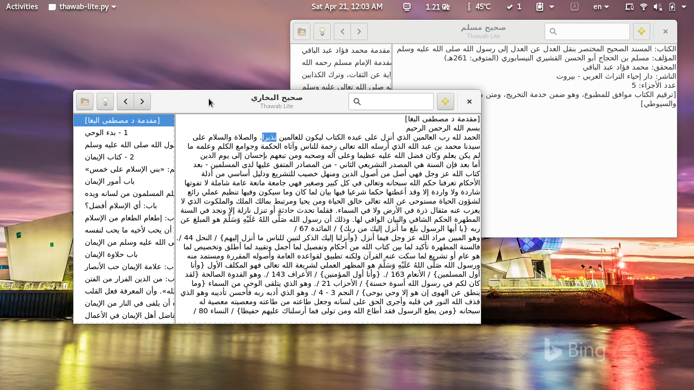

# Thawab-Lite - Shamela BOK reader

On-the-fly reader for [Shamela](http://shamela.ws/) BOK files



## Dependencies

This project uses `mdbtools` and `mdbtools-devel` (which provides `libmdbodbc.so`)

This project uses `GObject Introspection`
and works in either `python3` and `python2`,
for `python2` you need to install

```
dnf install mdbtools mdbtools-devel python2-six python2-gobject-base
```

for `python3` you need to install

```
dnf install mdbtools mdbtools-devel python3-six python3-gobject-base
```

For some reason `pyodbc` (both `pyodbc` and `python3-pyodbc`) did not work, that's why we need `pypyodbc`,
which can be installed from `python2-pip`

```
pip2 install pypyodbc
```
or from `python3-pip`

```
pip3 install pypyodbc
```

## Installation

You can please the executable in any directory like `/usr/local/bin/`
and data in `../share/thawab-lite/` (which would be `/usr/local/share/thawab-lite/`)

## Content

You can find books in [shamela.ws](http://shamela.ws/), 
it was tested using [Sahih Bukhari.bok](http://shamela.ws/index.php/book/1681)

